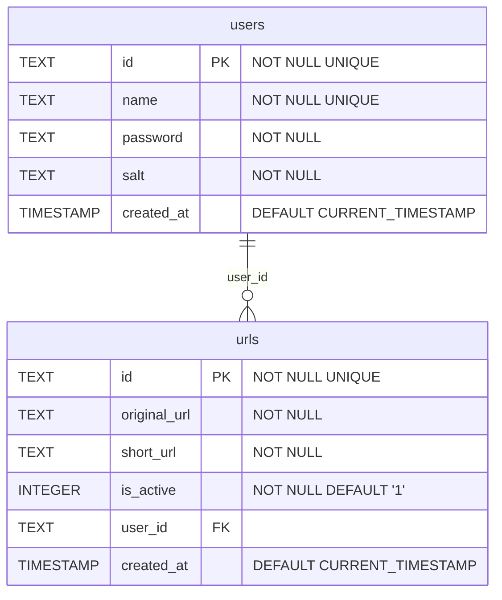

# Short URL

Short URL es un acortador de enlaces simple y eficiente, construido con JavaScript y CSS. Permite acortar URLs largas para facilitar su uso y compartirlas.

## Características

- **Acortar URLs**: Transforma URLs largas en versiones más cortas.
- **Frontend simple**: Interfaz de usuario amigable y minimalista.
- **Backend**: Implementación de una API para gestionar URLs.

## Tecnologías utilizadas

- **JavaScript**/**TypeScrupt**
- **CSS**
- **HTML**
- **React**
- **Vercel** para el despliegue
- **Turso.tech** para el uso de la base de datos
- **SQLite**

## Instalación

1. Clona este repositorio:
```bash
git clone https://github.com/lauta-dev/short-url.git
```

2. Instalar depenencias
```bash
pnpm install
```

3. Iniciar proyectos
```bash
pnpm run dev
```

## Diagrama de la base de datos



## [Métodos HTTP](./packages/server/endpoints.http)
